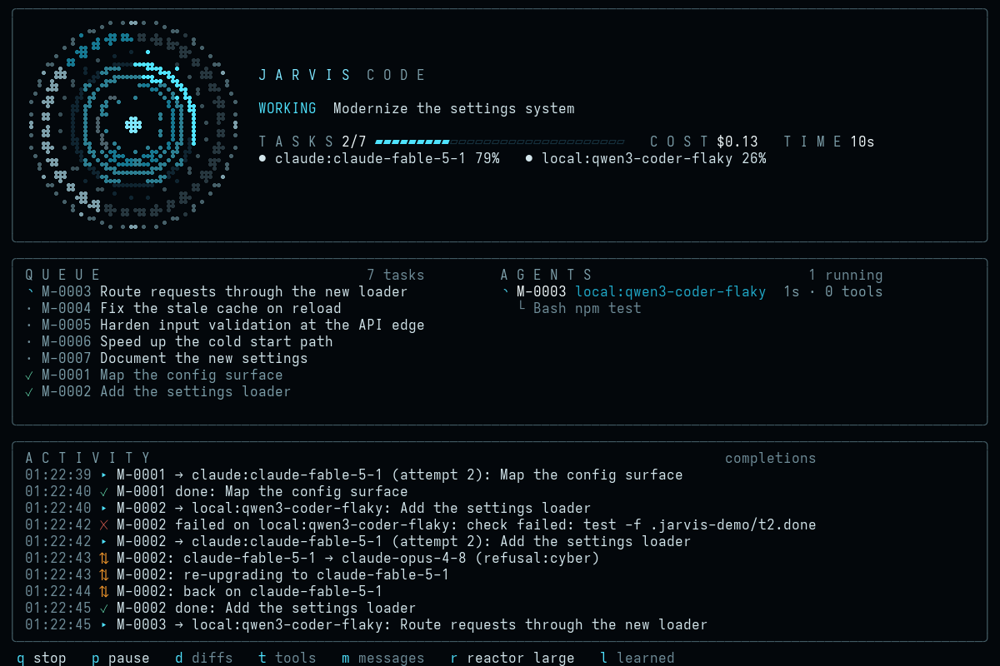

# jarvis-code

Hand a large change to a fleet of coding agents and watch the tasks, not the diffs.

jarvis-code plans a goal into tasks, works each one with **Claude Code**, **Codex**, **OpenCode**
or any other command-line agent, checks it with the task's own verify commands, and keeps the
queue, evidence and lessons in its own per-project store. Along the way it learns which
agents, models, subagents and tools actually work in your setup and stops using the ones that
don't. It also switches a downgraded model back to the one you configured.



The TUI is built around the Jarvis C2 arc reactor. The reactor turns while agents work, its
blades track the plan (finished, running, waiting), its level arc fills with progress, and it
changes colour when something needs you.

## Install

```sh
npm install -g --allow-git=all --allow-scripts=jarvis-code github:ChaseSunstrom/jarvis-code   # Node 22+; npm 12 needs both flags
jarvis-code doctor                                 # what it found: agents, plugin, terminal
jarvis-code demo                                   # simulated agents: no API calls
```

The global install is a copy of the package. To pick up a new version, such as a leak fix, run
the install command again and restart the cockpit. A cockpit that is already running keeps
the code it started with.

A cockpit that dies with `FATAL ERROR: ... JavaScript heap out of memory` near 4 GB after about
50 minutes is running code from before the leak fixes; with them, an hour's soak projects to
about 51 MB of heap. If `$(npm root -g)/jarvis-code/dist/src/tui/load.js` is missing, your install
predates them. Until the fixes are pushed, reinstall from your checkout with
`npm run build && npm install -g .` (with `sudo` if your global prefix needs it), then quit and
restart the cockpit.

jarvis-code uses the agents you already have on `PATH` (`claude`, `codex`, `opencode`). It needs
nothing else: tasks live under `$XDG_STATE_HOME/jarvis-code/projects/` (`JARVIS_CODE_STATE`
moves it), and `--tasks memory` keeps a run's queue in the process instead.

## Use

```sh
jarvis-code                                                   # the cockpit: every project and run
jarvis-code "migrate the settings system to the new loader"   # plan, then work the tasks
jarvis-code issue 42                                          # plan and work GitHub issue #42 (read with gh)
jarvis-code plan "add rate limiting to the API"               # plan into the queue and stop: see the tasks and estimate first
jarvis-code work                                              # work this project's open tasks
jarvis-code improve [focus]                                   # find and make the best improvements here
jarvis-code improve --rounds 5 --min 2                        # up to 5 rounds; one landing under 2 tasks ends it
jarvis-code status                                            # queue + agent health
jarvis-code tasks                                             # the queue; `task add|show|retry|defer|drop|approve`
jarvis-code history                                           # finished runs: cost and success across them (--json for scripts)
jarvis-code digest 7                                          # every project's runs this week, what they cost and what waits for you (for a standup)
jarvis-code find loader                                       # every task that mentions it or touched a matching file
jarvis-code status --all --json                               # every project's queue, for scripts
jarvis-code learn                                             # what it has learned; `learn reset [KEY]`
jarvis-code intent                                            # what you asked for and turned down; `intent reset`
```

Bare `jarvis-code` opens the **cockpit**: every project it has tasks for or was used in, their
queues and runs, and a prompt. The first time, it shows which agents it found and how to start. Type a goal to plan and run it in the selected project; several
projects can run at once. `/` opens the command menu:

| command | |
|---|---|
| `/run <goal>` · `/brainstorm <goal>` · `/work` | plan and work a goal · explore ideas first · work the open tasks |
| `/plan <goal>` | plan the goal into the queue and stop: its tasks, `/tree` and the estimate show what it would do; `/task drop\|defer\|bump` and `/tell` change it, then `/work` runs it. Refused while the project has a run going (that run would work the plan). A plan-only run writes no report and is not counted in `/history`; the later `/work` has no goal, so the goal's coverage check does not run |
| `/issue <n>` | plan and work GitHub issue n of this repository: read with `gh` (installed and logged in), its text quoted as material so it can't set routes or constraints; nothing is posted back (also `jarvis-code issue N`) |
| `/improve [focus]` | find and make the most valuable improvements to the selected project, brainstormed first |
| `/queue` · `/unqueue <n>` | a goal typed while the project's run is going waits in its queue (as a plain goal, even from `/brainstorm`) and starts when the run ends; the run's status line shows what is next · list them · take one off |
| `/tell <id> <note>` | a note for a task's next attempt: to the live run, else kept as the task's hint |
| `/open [project]` · `/home` · `/cd <project>` · `/add <dir>` | move between projects and runs |
| `/stop [all]` · `/pause` | stop a run (kills its workers; also a background run of the selected project) · finish running tasks, start no new ones |
| `/detach` | hand the selected project's run to the background: it keeps going after you quit |
| `/task add [TYPE:] <title>` · `/task show <id>` · `/task retry\|defer\|drop\|approve [id\|blocked\|review] [why]` · `/task bump [id]` | change the selected project's queue, or show a task's detail; a status word acts on every task in it; leave the id out to act on the open task; bump moves it to the front of the queue |
| `/trust <route or tool>` | forget what was learned about it, so it is used again |
| `/route [role\|TYPE\|default] [routes…\|-]` | the routing table, or set the agents a role or task type uses from the next run; this session only, `-` clears one |
| `/report` | the run's report: every task's outcome, what was learned and found |
| `/reports` | this project's past run reports, newest first |
| `/review` | triage every task in the project that needs you: why it stopped, the next step, and what its newest kept patch touched; ↑↓ picks one, Enter pages its patch, and `/task approve\|retry\|drop\|defer` without an id acts on the pick (the list refreshes) |
| `/ask <question>` | ask about this project's runs, tasks or code ("why did T-0003 fail?"): one read-only agent on a planner route reads jarvis-code's record of the project and the code, and its answer opens in a pager (also `jarvis-code ask "<question>"`) |
| `/find <text>` | every task in this project that mentions the text (title, brief, notes, lessons, criteria, attempts, planned files) or whose kept patch touched a matching file, with its status and where it matched (also `jarvis-code find <text>`) |
| `/history` | this project's finished runs: sparklines of cost and of the share of tasks done across runs, then each run's tasks, cost and length (also `jarvis-code history [--json]`) |
| `/graph` · `/tree` · `/timeline` | in a run: its planning pipeline and every agent run in it · its tasks by dependency · every agent run as a bar on one time axis, coloured by role (Esc closes) |
| `/ideas` | in a run: its brainstorm as a tree — categories, the ideas grown under them and their subtopics — each with a bar for its value and the critic's value/effort/risk; PgUp/PgDn scroll |
| `/stats` | in a run: charts of it — tasks by status, cost by role and by route, learned route scores, and sparklines of agent runs finished and money spent over time |
| `/diff [task]` | a task's last patch, coloured (the selected or open task by default); PgUp/PgDn scroll, Esc closes |
| `/undo [task\|run]` | take a landed task's changes back out of the working tree (its kept patch, reversed, all or nothing) and defer it; the route that did it is marked down for that kind of task, and intent memory counts it as turned down; `jarvis-code task undo ID` does the same. `run`: every task the newest run landed, newest first; again, the run before. It stops at the first patch that no longer reverses and says which came out. Refused while a run is going in the project |
| `/diffs` · `/tools` · `/messages` | show file changes, tool calls, agent messages (all off by default) |
| `/learned` · `/reactor` · `/help` · `/quit` | learned routes and tools · reactor size · every command · exit |

↑↓ select a project (in a run: pick a task, and the activity feed follows just that task's agents;
Enter opens its detail, Esc shows every line again), Enter opens its run, Tab on an
empty prompt in a run steps through its views (queue and agents, graph, tree, timeline, stats,
ideas; Shift+Tab goes back, and an open view takes most of the screen), PgUp/PgDn page back
through the activity and End returns to live, Esc goes back, Ctrl+C clears the prompt, then goes
home, then quits (twice while runs are going).

**Background runs.** `jarvis-code "<goal>" --detach` (or `work --detach`, `improve --detach`)
runs in the background and outlives the terminal. Its log is kept with the project's tasks.
`jarvis-code status` shows it, `jarvis-code stop` ends it, and the cockpit lists it and can
`/stop` it. `/detach` in the cockpit hands a working run to the background: running tasks are
restarted there. The cockpit shows a background run's progress and the tail of its log. A
project only ever has one run: a second one, from any process, is refused until the first ends.
The lock of a run that was killed is taken over, and a reused process id is not mistaken for it
(Linux). Each project keeps the logs of its last 20 background runs.

While a run is going, `jarvis-code status` prints the time since its last event, and warns if
it has gone quiet for ten minutes (a long check or a stuck agent). If the last run's lock is
still held but its process is gone, it died mid-run: status says so and `jarvis-code work` (or
`work --detach`) resumes it, putting its active tasks back in the queue. `status --all --json`
carries the same facts as `died` and `lastEventAt` fields, for scripts.

`--budget USD` and `--max-minutes N` cap one run: past either, jarvis-code stops dispatching and
kills its workers, and the unfinished tasks stay queued for `jarvis-code work`.

`improve` (in the cockpit, `--plain` or `--detach`, and the cockpit's `/improve`) runs rounds: each is an ordinary run whose goal names
what the last round closed and asks for what comes next. `--rounds N` caps them (default 3) and
`--min K` ends the loop after a round that lands fewer than K tasks (default 1); a stopped or
capped run ends it too. Each round's outcome and the reason the loop ended are printed.

Every run keeps a markdown report with the project's tasks, each with what its agents cost and how
long they took, and a Spend section by role and by route (`--plain` prints its path), rewritten
as each task finishes so a run that is killed partway still leaves one behind. When a task needs
you, the report opens with 'Needs you': every blocked or to-review task and its next step.
`notify` runs a command of yours with a one-line message as `$1` when a task blocks and when a
run ends. The message is an argument, never part of the command line.

`--plain` prints one line per event instead of the TUI. It is the default when stdout isn't a
terminal. The exit code is 0 when every task closed and 1 when any are blocked or need review.

## How a run works

1. **Plan.** Planning is a pipeline of read-only agents (see *Planning* below). It ends with a
   planner that turns the goal into small tasks, each with shell verify commands, which
   jarvis-code stores in the project's queue. With run history, the plan's note says what it
   will likely cost and take at this project's past pace per task.
2. **Dispatch.** For each ready task (understand, clean, speed up, secure, fix, then build;
   dependencies first) it picks a
   *route*, an agent plus model, from your preference list, skipping any the learning has
   switched off. With two or more worker routes, the planner may pick one per task (a stronger
   model for subtle work, a cheaper one for mechanical edits, going by how each has done here);
   a pick that is not one of your worker routes is dropped, and a good one gets the task's first
   attempt while it is healthy, retries choosing as usual.
3. **Work.** With `verify.preflight` on (the default), jarvis-code first runs every criterion's
   verify command on the untouched tree, so it knows what already passes before any change. The
   first attempt's prompt carries that baseline (a retry gets fresh results instead) plus a
   **Code you will touch** excerpt of the files the task names, and runs headless (`claude -p`
   stream-json, `codex exec --json`, `opencode run --format json`, or your command).
4. **Verify.** jarvis-code runs the task's verify commands itself and records each result as
   evidence on the task, with every attempt's route, cost and outcome.
5. **Review.** For risky tasks (tier M or L, or SECURITY; `review` sets which: `off`, `risky`,
   `all`), a second agent on another route reviews what the attempt changed. It sees the diff
   and the goal, not the worker's account of it. Unless `review` is `off`, any task whose change
   touches build, test or CI config (package.json, Makefile, pyproject.toml, test runner config,
   CI workflows, git hooks) is reviewed too, and the reviewer is told to check that it does not
   weaken a check to pass. When it asks for changes, that counts as a failed
   attempt: its findings go to the next attempt, and the worker's route is marked down. Diffs
   come from snapshots of the working tree in a temporary git index, so your index, branch and
   history are never touched. Outside a git repository, review is skipped.
6. **Close or retry.** When the checks pass (and the review approves), the task is closed. With
   `maxParallel > 1` in a git repository, each attempt works in its own worktree, made from the
   main tree as it is (uncommitted changes included) without touching your branches, refs or
   index. Its changes land in the main tree only when they pass, and the checks run again
   there. If the changes no longer apply, because another task changed the same lines first, the
   task waits for your review with its patch kept. A task without verify commands
   is flagged *needs review*. When a check fails, the next attempt goes to another route and
   includes the failure; when it fails the same way on two routes it is the check, not the agents,
   and the task is blocked at once. After `maxAttempts` the task is blocked with the reason.
   A failure is also named, and the name is appended to the reason wherever it is shown (the
   block, `notify`, the report): `bad-check` (the verify command itself doesn't exist), `env`
   (the same failure hit two routes), `flaky` (a rerun of the same attempt passed, so the route
   isn't charged for it), `transient` (a rate limit, overload or network drop before any check
   ran: the route isn't charged and the retry waits), `missing-context` (the agent asked a
   `BLOCKED:`/`NEEDS:` question), `too-big` (some checks passed and others didn't, or it ran out
   of turns, time or context), or `agent` (anything else). A task whose checks all passed before
   any change, and whose attempt changed nothing, waits for your review instead of closing: its
   checks prove nothing, or the work was already done.
7. **Re-plan once.** A planner gets the blocked task and why it stopped, and may split it into
   2–4 smaller tasks that replace it (its dependents then wait on them). A split task is never
   split again. When the failure needs a person, the task stays blocked and its dependents
   wait. `jarvis-code task retry ID` puts it back (`replan: false` turns this off). `jarvis-code
   task retry ID "<hint>"` passes that text on to the next worker as guidance. `jarvis-code task
   show ID` and `jarvis-code status` both print a `next:` line with the command that unsticks a
   blocked or to-review task.

### Workers stay workers

jarvis-code is the only planner and bookkeeper. Every worker gets the same standing rules:
- Do the one task, in scope.
- Fix root causes, and add a failing test first where the project has tests.
- Run the task's checks before finishing.
- No commits, pushes or changes outside the repository unless the task says so.

The jarvis-code plugin refuses task-state commands inside workers, and gives Claude Code
workers a `worker` skill with the same rules in depth. Other planning plugins would run a
second loop inside a worker, so Claude Code workers start with them switched off
(`agents.claude.disablePlugins`).

Workers end with notes that jarvis-code keeps:
- `LESSON: …` is stored on the task and given to later workers in the same project, so a
  quirk learned once (a required env var, a flaky test) is not rediscovered.
- `FOLLOW-UP: …` is a real problem found outside the task. It becomes a deferred task:
  `jarvis-code tasks --all` lists it, and `task retry ID` queues it.
- `TRIED: …` and `NEXT: …` are a handoff from a worker that stopped short. They lead the note
  the next attempt gets, ahead of which checks already passed, which failed and why, and a diff
  of what the failed attempt changed (kept if it's still in the tree, redone from scratch if a
  worktree already took it away).

### Planning

With `planning.mode` `auto` (the default), a goal goes through up to four stages before any code
is written:

1. **Prompt writer.** One agent reads the repository and writes the prompt the planner will work
   from: the goal restated precisely, the files and commands that matter, what done looks like,
   and open questions with its best assumption. It also calls the goal *concrete* or *open*.
2. **Brainstorm** (open goals only). By default (`planning.brainstorm: "tree"`) it grows a tree,
   the way you would think it through: one agent splits the goal into categories (interface,
   security, performance, …, specific to the project, covering `planning.lenses` and up to three
   angles the prompt writer suggests); then each category is grown level by level, one session
   per category per level, spread across your agents so different models grow different
   branches: broad ideas first, then more specific ideas under the best `breadth` of them, then
   under the best of those, down to `depth` levels. Each session sees what its category already
   holds and has to go past it. `maxCalls` caps the sessions (6 categories at depth 4 is 19);
   a level that adds nothing ends it. The planner sees each idea with its path in the tree
   (`Interface › Charts › Sparklines`), and the brainstorm is kept nested in the project's
   research. `"flat"` runs each angle as its own session instead, in rounds where every round
   sees all the ideas so far; rounds stop when one adds fewer than `minNew` new ideas, or after
   `rounds`.
   Brainstormers read the code their ideas touch, read-only (Claude Code without its edit tools,
   Codex in `--sandbox read-only`, OpenCode's `plan` agent), and cite a file per idea. A `generic`
   agent has no read-only mode, so as a brainstormer it can change files. Near-duplicate ideas
   are merged into one.
3. **Critique** (`planning.critique`). A critic on another route checks each idea against the
   code, read-only, and scores its value, effort and risk. The planner gets the ideas best first.
   A critic that gives no usable scores leaves them unranked.
4. **Planner.** It runs on a different agent from the prompt writer when you have one. It gets
   the prompt and the ideas, keeps the best value for the effort, and plans that.
5. **Coverage** (`planning.coverage`). Once the tasks settle, an agent on a reviewer route checks
   each done item (the prompt writer's, plus the goal's `DONE-WHEN:` lines) against what landed.
   Unmet items are planned into follow-up tasks and worked in the same run, once. `/graph` lists
   each item under the goal as met, unmet or open, with the tasks that cover it.

Both the prompt writer and the planner start from facts jarvis-code gathers itself: the
top-level layout, the README's first lines, build and test scripts, recent commits, tasks already
queued, lessons from earlier workers, how each worker route has done, the opening of the
repository's conventions file (`CLAUDE.md`, `AGENTS.md` or `CONTRIBUTING.md`), and a map of its
tracked files by directory. A goal can be a tagged
list: `FIX:`/`FEATURE:`/… lines become separate items, and `MUST:`, `NEVER:` and `DONE-WHEN:`
lines become constraints every task has to respect. A plan whose tasks lack verify commands,
use unknown types or tiers, or depend on tasks in a cycle goes back to its planner once with the
problems listed. So does a verify command that can never fail — a bare `true` or `echo`, or an
`|| true`-style fallback — or one that pipes into `tail`, `grep`, `sort` and the like without
`set -o pipefail`, which would hide a real failure upstream of the pipe. Each criterion also
needs its own verify command: two criteria sharing one check go back too, so a pass on one can't
stand in for the other. jarvis-code refuses to run a verify command that escalates privileges, wipes a
home or root directory, pipes a download into a shell, or publishes (`git push`, `npm publish`).
Such a criterion loses its command, and the task waits for your review.

The prompt, the brainstorm and the plan are kept with the project's tasks. `direct` skips to a
single planner, and `deep` always brainstorms. `--planning MODE` sets it for one run, and
`/brainstorm <goal>` in the cockpit is `deep` for that goal.

### Learning

Every task outcome is recorded against its route (`claude:claude-fable-5-1`,
`local:ollama/qwen3-coder`, …) as a decayed success rate. Once a route has `minSamples` runs and
its rate drops below `disableBelow`, it is **switched off** for `cooldownMin`. It then gets one probe run:
if the probe fails the cooldown doubles, and if it passes the route comes back. If every route is
off, the one whose cooldown ends first is probed early rather than stalling the queue.

Worker outcomes are also kept **per task type** (`claude:model@SECURITY`), with the same switch.
A model that keeps failing security work is skipped for it and keeps its CLEAN and FIX tasks.
`strategy: "best"` ranks by a task type's own record once it has a few runs. `"escalate"` reads
your `workers` list as cheapest to strongest: S tasks start cheap, M in the middle, and L or
SECURITY tasks start strongest, with each failed attempt moving up. Unless the order is plain
`priority`, each dispatch line in the feed says why its route was chosen.

Tools are learned the same way, **per orchestrating agent**. When `Agent(Explore)` keeps failing
under Claude Code, or an MCP server keeps erroring under Codex, that tool is refused for that agent
only, through the plugin hook and `--disallowedTools`. Core tools (Bash, Read, Edit, …) are never
switched off, because a failing test is not a broken tool.

```sh
jarvis-code learn                  # routes and tools, scores, what is off and why
jarvis-code learn reset local:ollama/qwen3-coder
```

### Intent memory

jarvis-code keeps a short record of what you ask for and turn down, across projects, so later
plans lean toward what you want. It stores only what you did: the goals you type and the tasks you
drop or approve, each with the time and the project's directory name. It never stores agent
output, so no repository can write itself into every later project's prompts. Secrets (API keys
and other long tokens) are redacted, your home directory is written as `~`, and each entry is
capped at 300 characters.

It is one append-only file, `intent.jsonl`, in the state dir (`~/.local/state/jarvis-code` by
default; `JARVIS_CODE_STATE` moves it), trimmed to the newest 500 entries as it grows.

```sh
jarvis-code intent                 # recent asks and drops, per project
jarvis-code intent reset           # forget all of it
```

`"intent": false` in the config turns it off, so nothing new is recorded.

### Model downgrades

Claude Code sometimes moves a session to a fallback model when a message is flagged (Fable → Opus,
for example), and most of those flags are false positives. jarvis-code reads the structured events
(`model_refusal_fallback`, `model_consent_fallback`, `model_fallback`, plus a check of each
message's `model` field) and applies your policy:

- **reupgrade** (default): sends `set_model` back to the configured model. Claude Code applies a
  switch from the next turn, so once the downgraded turn ends jarvis-code runs one follow-up turn
  on the restored model to review and finish the task. That turn has the last word.
- **retry**: reruns the whole task on the configured model.
- **accept**: keep going on the fallback.

Turn-scoped fallbacks (overload, availability) return to the primary on their own and are only
logged. Usage-credit consent swaps are left alone, because switching back would only reopen the
same prompt.

## Configure

`~/.config/jarvis-code/config.json` (global) and `.jarvis-code.json` (per repo) are merged over
the defaults. Objects merge, arrays replace. `jarvis-code config init` writes a starter file, and
`config show` prints the result.

```jsonc
{
  "agents": {
    "claude":   { "models": ["claude-fable-5-1"] },
    "codex":    { "enabled": "auto", "models": ["gpt-6-sol"] },
    // your own model through OpenCode: its own route, judged on its own record
    "local":    { "kind": "opencode", "models": ["ollama/qwen3-coder"] },
    // any other CLI agent: {prompt} and {model} are substituted
    "aider":    { "kind": "generic", "bin": "aider", "args": ["--yes", "--message", "{prompt}"] }
  },
  "workers": ["local:ollama/qwen3-coder", "claude:claude-fable-5-1", "codex"],  // preference order
  "planner": ["claude:claude-fable-5-1"],
  // keys: a task type (workers only), a role (promptWriter · brainstorm · critic · planner · reviewer · workers) or "default".
  // Each role takes the first level with an enabled agent: task type → role → planner/workers list (brainstorm and reviewer: both) → default → every enabled agent
  "routes": { "SECURITY": ["codex"], "brainstorm": ["claude", "codex"] },
  "strategy": "priority",          // "best": highest learned score (for the task's type once known) · "escalate": workers listed cheapest → strongest
  "maxAttempts": 3,
  "maxParallel": 1,                // >1 runs workers side by side, each in its own git worktree
  "worktrees": true,               // false: parallel workers share the one working tree
  "verify": { "timeoutSec": 600, "preflight": true, "final": false },  // preflight: run every criterion's check on the untouched tree first, so the worker knows what already passes · final: after the last task, rerun the checks of every task closed in the run and report any that now fail
  "ui": { "showDiffs": false, "showTools": false, "showText": false, "reactor": "large", "reactorStyle": "blocks", "icons": "text", "fps": 24, "reducedMotion": false },
  "learning": { "minSamples": 3, "disableBelow": 0.35, "cooldownMin": 1440, "decay": 0.9, "blockTools": true, "neverBlock": [] },
  "downgrade": {
    "default": { "action": "reupgrade", "max": 3 },
    "models": { "claude-fable*": { "action": "reupgrade", "to": "claude-fable-5-1", "max": 5 } }
  },
  "review": "risky",               // off · risky (tier M/L, SECURITY, or a change to build/test/CI config) · all
  "replan": true,                  // split a blocked task once into smaller ones
  "notify": "",                    // e.g. "notify-send jarvis-code \"$1\"": run when a task blocks and when a run ends
  "budget": { "usd": 0, "minutes": 0 },  // per run, 0 = no cap; over a cap the run stops and kills its workers
  "planning": {
    "mode": "auto",
    "brainstorm": "tree",          // "tree": categories → broad ideas → subtopics → deeper · "flat": every angle in rounds
    "tree": { "depth": 4, "categories": 6, "breadth": 3, "maxCalls": 24 },  // levels counting the categories · the best `breadth` of each level grow · agent sessions at most
    "lenses": ["user value", "reliability", "simplicity", "bold bets", "unstated needs (what the user will want next without saying it)"],
    "rounds": 3, "minNew": 3, "parallel": 4,  // flat rounds · brainstorm sessions at once (both modes)
    "critique": true,              // a critic on another agent scores and ranks the ideas before the planner sees them
    "coverage": true               // at the end of a run, check the goal's done-items against what landed and queue work for the gaps
  },
  "intent": true,                  // remember (redacted, across projects) what you ask for and turn down, so later plans lean your way
  "improve": { "rounds": 3, "minLanded": 1 }  // improve runs up to `rounds` plan-and-work rounds; one landing fewer than `minLanded` tasks ends it
}
```

(The comments are for this page; the files are plain JSON.)

**A repository's own config can't run commands until you trust it.** A cloned repository's
`.jarvis-code.json` still applies its models, routes, planning, review, budgets and UI. The keys
that decide what runs on your machine are ignored, with a warning, until you run
`jarvis-code config trust` in that directory: `notify`, an agent's `bin`, `args`, `env` or
`kind`, and new `generic` agents. Trust covers that exact file, so any edit needs trusting again
(`config untrust` takes it back). Your global config is always trusted. `JARVIS_CODE_TRUST=all`
trusts every project config, for CI and containers where you control the checkout.

Agent fields: `kind` (`claude` · `codex` · `opencode` · `generic`), `enabled` (`true` · `false` ·
`"auto"` = on when `bin` is on `PATH`), `bin`, `models` (each is a route, empty = the CLI's
default), `args`, `env`, `timeoutMin`, `idleMin` (a worker silent this long is killed as hung; default 30), `disablePlugins` (Claude Code plugins switched off inside
workers). Codex workers get `--sandbox workspace-write` unless your `args` choose a sandbox.

## The plugin

`plugin/` is the worker side of jarvis-code. It does nothing outside a jarvis-code run
(`JARVIS_CODE_RUN` unset), so installing it globally never changes a normal session. Inside a
run it refuses the tools the learning switched off for that agent and any task-state commands.

| agent | how it loads |
|---|---|
| Claude Code | per worker with `--plugin-dir`, automatically; or `jarvis-code plugin install claude` (adds this repo as a marketplace), which also gives interactive sessions the `jarvis-code` skill, the MCP server, `/jarvis-code:status` and `/jarvis-code:queue` |
| Codex | `jarvis-code plugin install codex` adds a PreToolUse hook to `~/.codex/hooks.json` (Codex asks you to trust it once) and the MCP server to `~/.codex/config.toml` |
| OpenCode | `jarvis-code plugin install opencode` links `plugin/opencode/jarvis-code.js` into `~/.config/opencode/plugins/` and adds the MCP server to `~/.config/opencode/opencode.json` |

`jarvis-code plugin status` shows what is installed, and `plugin uninstall <agent>` removes only
what jarvis-code added.

**From inside an agent session.** `jarvis-code mcp` is an MCP server (stdio) that lets an
interactive Claude Code, Codex or OpenCode session see and steer jarvis-code in the project it
runs in. Its tools: `status`, `tasks`, `task_show` and `history` to look; `queue_goal` to hand
jarvis-code a goal (it plans and works it in the background, or queues it behind the run already
going); `add_task`; and `tell`, a note for a task's next attempt. The changing tools are marked
not read-only, so the agent asks before using them. It comes with the Claude Code plugin (with
`/jarvis-code:queue <goal>`), and `plugin install codex|opencode` registers it in Codex's
`config.toml` and OpenCode's `opencode.json` (an `opencode.json` with comments is left as it is,
and the entry to add is printed). A call acts only on the session's own directory or one inside
it, and what it stores is capped in size. Inside a jarvis-code worker it offers no tools.

## Develop

```sh
npm install
npm test                           # build + unit + end-to-end (fake agents, isolated state)
node scripts/verify-reactor.mjs    # runs the demo in a real pty and checks the reactor animates, then holds still
```

`src/` has:
- `orchestrator.ts`: plan → dispatch → verify → review → land → close, retry or re-plan.
- `pipeline.ts` (prompt writer, brainstorm, planner prompts) and `context.ts` (repository facts,
  tagged goals, plan validation).
- `review.ts` (tree snapshots, the review gate) and `worktree.ts` (parallel attempts).
- `excerpt.ts` (the code a task names, for its worker) and `diagnose.ts` (why an attempt failed).
- `agents/` (one adapter per CLI, normalized events), `learn.ts` (routes, task types, tools,
  circuit breaker) and `downgrade.ts`.
- `store.ts` (the per-project task store) and `tasks.ts` (task sources).
- `reactor.ts`, `tui/` (Ink: the cockpit and its parts) and `plain.ts`.

`src/demo-agent.ts` stands in for every agent role in the demo and the tests. It speaks Claude
Code's stream-json protocol, including its model-switch timing.

### Known limits

- Codex and OpenCode adapters follow their documented JSON event formats and are tested against
  recorded fixtures, not a live install. Unknown events are ignored, so a newer CLI degrades to
  "final message + exit code".
- Learned tool blocking is enforced by the plugin. Claude Code workers always load it; Codex and
  OpenCode only have it after `jarvis-code plugin install codex|opencode` (`doctor` warns when
  it's missing). Without it those agents are told which tools are off, but nothing stops them.
- Brainstorming costs agent sessions: the tree takes one for its categories plus one per
  category per level (up to 19 by default, never more than `planning.tree.maxCalls`); flat takes
  one per angle per round. On metered APIs lower `planning.tree.depth` or `categories`, or plan
  `direct`.
- Downgrade detection is structured for Claude Code only. Codex and OpenCode don't report a model
  switch in their event streams.
- Review snapshots hash untracked files that `.gitignore` doesn't exclude, twice per reviewed
  attempt. Ignore large generated directories, or set `review` to `off`, in repositories that
  keep big untracked output. A review needs a second route: with a single agent and model there
  is none, and tasks close on their checks.
- Worktrees live in the repository's git directory (`.git/jarvis-code-worktrees/`). Each gets a
  hard-linked copy of the main tree's `node_modules`, `.venv`, `venv` and `vendor`, so its checks
  can run, and a worker deleting or reinstalling them leaves yours alone. Where hard links are
  impossible (another filesystem, no `cp -al`), they are symlinked, and so shared. Other ignored
  files (build output, local config) are not there: a worktree builds from scratch. Worktrees
  left by a run that was killed are removed by the next run. Outside a git repository,
  or with `worktrees: false`, parallel workers share one tree, and a review's diff can include
  another worker's changes.

The reactor's geometry, palette and motion come from the Jarvis design system. In a terminal it
is drawn as anti-aliased half blocks: two square truecolour pixels per cell on a dark lens, which
looks the same in any font (`"reactorStyle": "braille"` gives finer dots where the font draws
braille well). Its shapes never move, only its light does, so it doesn't shimmer at low resolution.

MIT © Chase Sunstrom
